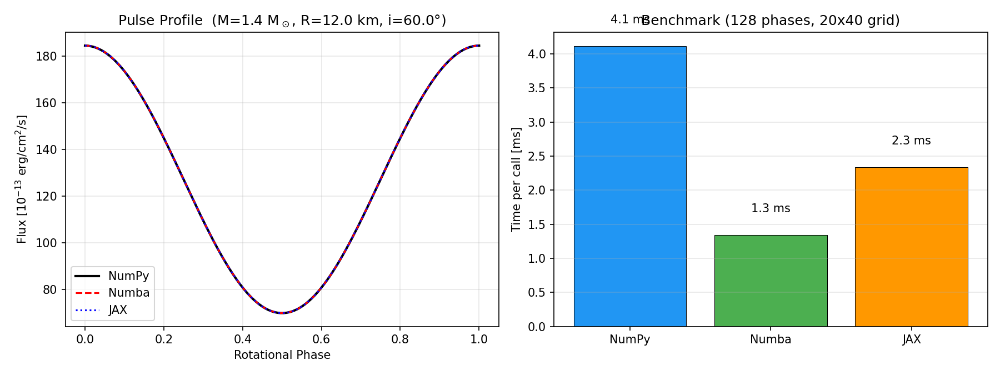

# Toy Model: X-ray Pulse Profile from a Spinning Neutron Star

A minimal forward model for X-ray pulse-profile generation. Demonstrates three acceleration strategies: pure NumPy, Numba JIT, and JAX JIT. Intended as a computational sandbox for understanding the X-PSI inference pipeline.

Uses the **Beloborodov (2002)** approximation for gravitational light bending.

## Setup

```bash
conda create -n denserprep python=3.11 -y
conda activate denserprep
# Install via conda-forge to get pre-built llvmlite (required by numba)
conda install -c conda-forge numba -y
pip install numpy scipy matplotlib "jax[cpu]" cython jupyter scikit-learn
```

## Usage

```python
import numpy as np
import toymodel_numpy as tm

phases = np.linspace(0, 1, 128)
flux = tm.pulse_profile(phases, M=1.4, R=12.0, i_deg=60.0,
                        theta_deg=30.0, rho_deg=10.0,
                        T_keV=0.3, D_kpc=1.0)
```

## Benchmark

```bash
python benchmark.py
```



## Files

| File | Description |
|------|-------------|
| `toymodel_numpy.py` | Baseline pure NumPy implementation |
| `toymodel_numba.py` | Numba `@njit` accelerated version (~3x speedup) |
| `toymodel_jax.py` | JAX `@jit` accelerated version (GPU-ready, ~2x on CPU) |
| `benchmark.py` | Benchmark script verifying consistency and timing |
| `benchmark.png` | Benchmark plot (pulse profile + timing bar chart) |

## Physics

- **Light bending**: Beloborodov (2002) approximation — `1 − cos α ≈ (1 − cos ψ)(1 − r_s/R)`
- **Spot visibility**: A point on the star is visible when `cos α > 0` (emission angle < 90°)
- **Occultation**: If `inclination + colatitude < 90°`, the spot never disappears behind the star
- **Flux**: Blackbody surface brightness, integrated over the spot, corrected for gravitational redshift

## Parameters

| Parameter | Symbol | Units |
|-----------|--------|-------|
| Mass | `M` | M☉ |
| Radius | `R` | km |
| Observer inclination | `i_deg` | degrees |
| Spot colatitude | `theta_deg` | degrees |
| Spot angular radius | `rho_deg` | degrees |
| Temperature | `T_keV` | keV |
| Distance | `D_kpc` | kpc |

## References

- Beloborodov A.M., 2002, ApJL, 566, L85
- Riley et al., 2019, ApJL, 887, L21 (first NICER PSR J0030 result)
- Salmi et al., 2022, ApJ, 941, 150
